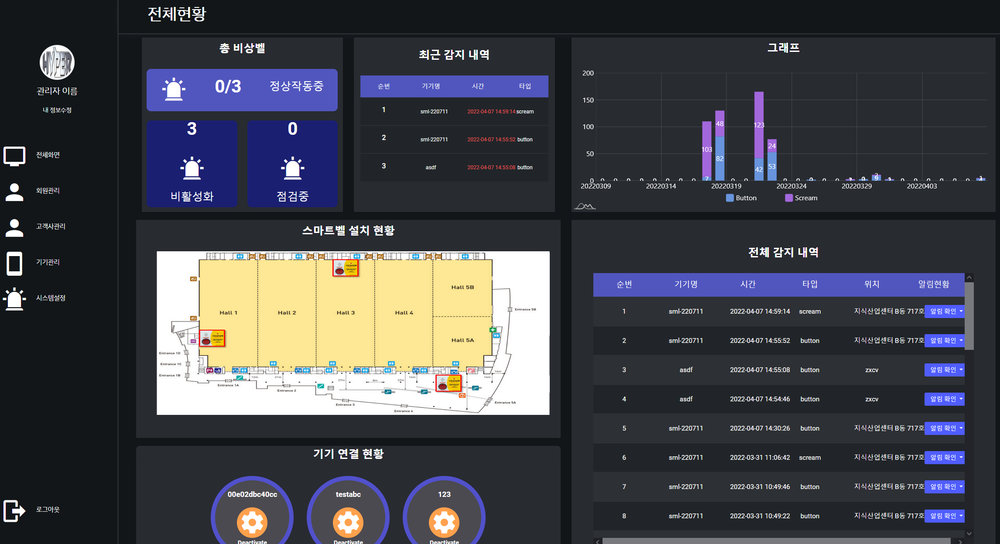

# 스마트 비상벨 대시보드

스마트 비상벨 관리 대시보드입니다.  

## 주요기능
- 대시보드를 통한 기기의 연결상태 확인
- 스마트 비상벨의 알람 실시간 확인
- 알람 설정 및 통계 확인  
- 고객사 정보 관리(서버 관리자)  
v0.1에서는 누구나 회원 가입이 가능했으나, 0.2부터는 서버 관리자만 회원을 추가할 수 있습니다.  

## 개발 환경
- 프로젝트: Angular CLI v13.2.5.
- 실행 파일: run.sh

## 실행 화면
